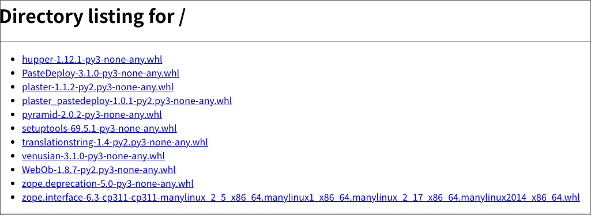

# はじめに

## お前誰よ
1.  

    -   Atsushi Odagiri
    -   Open Collector
    -   Pythonは1.5くらいのころから

2.  

    

    

    


## 私と静岡

- 小中
  - 磐田
- 高
  - 沼津
  - 長泉町
- バイト
  - 富士
  - 沼津
  - 三島
  - 熱海
  - 修善寺
  - 伊東

## 私とプログラミング

- UNIX
  - 演習室にあったのがSPARC
  - SUN OSだったと思う
  - 本当のvi(vimのviモードのような紛い物にあらず)
- PASCAL
  - 高級言語
  - 構造化プログラミング
- アセンブラ
  - 低級言語
- LINUX
  - ええっ!パソコンでUNIXを!？
  - Emacsに出会う
- C/C++
  - 実用

## そして豊橋、名古屋へ

- 後編は PyCon mini 東海 で!
  - という予定でした

# パッケージを配るということ

## パッケージエコシステム

-   作る
    -   setuptools, poetry-core, hatchling...
-   配る
    -   pypi
-   使う
    -   pip, poetry, hatch...

## パッケージを配るということ

-   広く一般に向けて配る
-   狭い範囲で限られた利用のために配る

## 広く一般に向けてpypiで配る

-   PyPAツールのデフォルト
-   `tween` でアップロード
-   `pip` がダウンロードしてインストール

## 狭い範囲で限られた利用のために配る

-   マイクロサービスのそれぞれて使うようなライブラリ
-   特殊なパッチをあてたローカルフレーバーライブラリ

## 狭い範囲で配る

-   社内ネットワークやVPNの中で
-   k8sやvpcの中で
-   範囲内のIPアドレスにだけ
-   認証をつけたい

## httplib.server でのお手軽repository

-   ダウンロードできるリンクがあればいいので `http`
    モジュールでサーバーを起動するだけ
-   wheelファイルのあるディレクトリで実行

``` shell
python3 -m pip download pyramid
python3 -m http.server
```



## URL指定でインストール

-   pipはURL指定で直接インストールできる
-   正確なファイル名を知らないといけない
-   wheelはプラットフォームなどの情報を含んでいる

``` shell
pip install \
    http://localhost:8000/pyramid-2.0.2-py3-none-any.whl
```

## 複雑なwheelファイル名

-   oh...

``` example
zope.interface-6.4
-cp311
-cp311
-manylinux_2_5_x86_64.manylinux1_x86_64.manylinux_2_17_x86_64.manylinux2014_x86_64
.whl
```

## find-links

-   `find-links` で指定した場所から探しだしてもらう

``` shell
pip install -f http://localhost:8000 zope.interface
```

## no-index

-   場合によってはpypiへの接続も制限される環境

-   全てをお手軽repositoryから取得するなら `no-index`
    も使うようにしてみよう

-   `no-index` pypiなどのindexを見にいかない

-   `find-url` 指定したページからダウンロードURLをスクレーピング

## indexは必要？

-   pipを直接使うなら `find-url` でもいいかも？
-   メタデータを取得するのに配布物をダウンロードするという効率の悪さはある
-   `poetry source add` で使えるのは simple repository
    -   pipだと `--index-url` で指定するものに相当

## 独自のpypiを立てたい!

-   PyPI自体のソースコードは公開されている
    -   <https://github.com/pypi/warehouse>
    -   インフラ構築保守など手間もかかる
-   devpi
    -   <https://github.com/devpi/devpi>
    -   PyPIへのプロキシやプロジェクトごとの名前空間設定など多機能
    -   それなりにインフラ構築保守の手間がかかる
-   `http.server` くらいに簡単に立ち上って欲しいところ

# パッケージを配るためのPEP

## パッケージを配るためのPEP

-   [PEP 458 -- Secure PyPI downloads with signed repository
    metadata](https://peps.python.org/pep-0458)
-   [PEP 480 -- Surviving a Compromise of PyPI: End-to-end signing of
    packages](https://peps.python.org/pep-0480)
-   [PEP 503 -- Simple Repository
    API](https://peps.python.org/pep-0503/)
-   [PEP 592 -- Adding "Yank" Support to the Simple
    API](https://peps.python.org/pep-0592)
-   [PEP 629 -- Versioning PyPI's Simple
    API](https://peps.python.org/pep-0629)
-   [PEP 658 -- Serve Distribution Metadata in the Simple Repository
    API](https://peps.python.org/pep-0658)
-   [PEP 691 -- JSON-based Simple API for Python Package
    Indexes](https://peps.python.org/pep-0691)
-   [PEP 700 -- Additional Fields for the Simple API for Package
    Indexes](https://peps.python.org/pep-0700)
-   [PEP 714 -- Rename dist-info-metadata in the Simple
    API](https://peps.python.org/pep-0714)

## Simple Repository

representation

-   HTML PEP503
-   JSON PEP691

バージョン

-   1.0 PEP503/PEP691
-   1.1 PEP700
-   PEP714 メタデータフィールドの取り扱いについての修正
    -   warehouseの実装で間違えがあったらしい

## PyPIのSimple Repository

-   <https://pypi.org/simple/> とても大きいのでアクセス注意！

## 実装方針

-   標準ライブラリでいこう
    -   Batteries Included!
-   1ファイルデプロイ
-   DBなどを使わず起動するだけで使える

## project list

-   ホストしているプロジェクト(ほぼパッケージの意味)を一覧で出すだけ
-   v1.0のプロジェクトに関する情報は `name` のみ

## 使うライブラリ

-   これだけ!
-   100% 標準ライブラリのみ!

``` {.python tangle="micropypiapp.py"}
import argparse
import hashlib
import itertools
import json
import operator
import pathlib
import re
import zipfile
from typing import TypedDict, NotRequired, Iterable
from wsgiref.types import WSGIApplication, WSGIEnvironment, StartResponse
from wsgiref.simple_server import make_server
```

## Meta

-   simple repositoryに関する情報
-   バージョン

``` {.python tangle="micropypiapp.py"}
Meta = TypedDict(
    "Meta",
    {
        "api-version": str,
    },
)
```

## project detail

-   プロジェクト(パッケージ)ごとのダウンロード可能なファイル一覧
-   ファイルのURLやパッケージメタデータなど

## project fileのtyping

-   事前に確認可能なパッケージメタデータ
-   ダウンロードに必要な情報 URLやハッシュ

``` {.python tangle="micropypiapp.py"}
ProjectFile = TypedDict(
    "ProjectFile",
    {
        "filename": str,
        "url": str,
        "hashes": dict[str, str],
        "requires-python": NotRequired[str],
        "dist-info-metadata": NotRequired[bool],
        "core-metadata": NotRequired[bool],
        "gpg-sig": NotRequired[bool],
        "yanked": NotRequired[bool],
    },
)

```

## project detailのtyping

-   project fileの一覧が主な情報

``` {.python tangle="micropypiapp.py"}
ProjectDetail = TypedDict(
    "ProjectDetail",
    {
        "name": str,
        "files": list[ProjectFile],
        "meta": Meta,
    },
)

```

## project list のtyping

``` {.python tangle="micropypiapp.py"}
Project = TypedDict("Project", {"name": str})
ProjectList = TypedDict(
    "ProjectList",
    {
        "meta": Meta,
        "projects": list[Project],
    },
)

```

## wheelファイルを探しだす

-   pathlibでできちゃうね!

``` python
wheelhouse.glob("*.whl")
```

## wheelファイル名から情報を取得

-   wheelファイルのファイル名は形式が決まっている
    -   PEP 491 The Wheel Binary Package Format 1.9
    -   `{distribution}-{version}(-{build tag})?-{python tag}-{abi tag}-{platform tag}.whl.`

## wheelファイル名から情報を取得

-   今回欲しいのは `distiribution`
-   `"-"` で `split` して最初の1つ

``` {.python tangle="micropypiapp.py"}
def extract_dist_name(wh: pathlib.Path) -> str:
    return wh.name.split("-", 1)[0]
```

## プロジェクト名を正規化

-   PEP 503 で正式に正規化方法が定義されている
-   アルファベットは全て小文字
-   記号は `-` に正規化
-   例: `zope.interface` -\> `zope-interface`

``` {.python tangle="micropypiapp.py"}
def normalize(name: str) -> str:
    return re.sub(r"[-_.]+", "-", name).lower()
```

## metadata

-   METADATAをwheelから取り出す
-   wheelはzipファイル
-   METADATAの場所は決まっている
    -   PEP 491 The Wheel Binary Package Format 1.9
    -   `{distribution}-{version}.dist-info/` contains metadata.

``` {.python tangle="micropypiapp.py"}
def get_metadata(whl: pathlib.Path):
    parts = whl.name.split("-")
    dist_name, version = parts[0], parts[1]
    metadata_path = f"{dist_name}-{version}.dist-info/METADATA"
    with zipfile.ZipFile(whl) as zf:
        with zf.open(metadata_path) as metadata:
            return metadata.read()

```

## 全部まとめてwheelファイルの情報を取得

-   プロジェクト名をキーにしてメタデータとwheelファイルパスをグルーピング

``` {.python tangle="micropypiapp.py"}
def load_wheels(
    wheelhouse: pathlib.Path,
) -> Iterable[tuple[str, Iterable[tuple[str, bytes, pathlib.Path]]]]:
    wheels = itertools.groupby(
        (
            (normalize(extract_dist_name(w)), get_metadata(w), w)
            for w in wheelhouse.glob("*.whl")
        ),
        key=operator.itemgetter(0),
    )
    return wheels
```

## プロジェクトごとにファイル情報をまとめる

-   プロジェクト名、メタデータ、wheelファイルパスをもとにJSONデータを作成

``` {#project-file-loop .python}
project = ProjectDetail(
    {"name": project_name, "files": [], "meta": meta})
project_details[project_name] = project
for _, metadata, p in files:
    hash = hashlib.sha256(p.read_bytes()).hexdigest()
    f = ProjectFile(
        {
            "filename": p.name,
            "url": f"/{project_name}/files/{p.name}",
            "hashes": {
                "sha256": hash,
            },
            "dist-info-metadata": True,
            "core-metadata": True,
        }
    )
    project["files"].append(f)

```

## wsgiアプリケーション:project list

``` {.python tangle="micropypiapp.py"}
class ProjectListApp:
    def __init__(self, project_list: ProjectList) -> None:
        self.project_list = project_list

    def __call__(
        self, environ: WSGIEnvironment, start_response: StartResponse
    ) -> Iterable[bytes]:
        start_response(
            "200 OK", [("Content-Type", "application/vnd.pypi.simple.v1+json")]
        )
        return [json.dumps(self.project_list).encode("utf-8")]

```

## wsgiアプリケーション:project detail

``` {.python tangle="micropypiapp.py"}
class ProjectDetailApp:
    def __init__(self, project_details: dict[str, ProjectDetail]) -> None:
        self.project_details = project_details

    def __call__(
        self, environ: WSGIEnvironment, start_response: StartResponse
    ) -> Iterable[bytes]:
        project_name = environ["wsgiorg.routing_args"][1]["project_name"]
        if project_name not in self.project_details:
            return not_found(environ, start_response)
        start_response(
            "200 OK", [("Content-Type", "application/vnd.pypi.simple.v1+json")]
        )
        return [json.dumps(self.project_details[project_name]).encode("utf-8")]

```

## wsgiアプリケーション:ダウンロード

-   wheelファイルの中身をレスポンスボディにする
-   wheelのcontent-typeは特に決まってないので `application/octet-stream`
    にする
-   ブラウザでアクセスしたときにダウンロードになるよう
    `Content-Disposition` をつける

``` {.python tangle="micropypiapp.py"}
class WheelDownloadApp:
    def __init__(self, wheelhouse: pathlib.Path) -> None:
        self.wheelhouse = wheelhouse

    def __call__(
        self, environ: WSGIEnvironment, start_response: StartResponse
    ) -> Iterable[bytes]:
        file_name: str = environ["wsgiorg.routing_args"][1]["wheel_file_name"]
        p = self.wheelhouse / file_name
        if not p.exists():
            return not_found(environ, start_response)
        start_response(
            "200 OK",
            [
                ("Content-Type", "application/octed-stream"),
                ("Content-Disposition", f'attachment; filename="{file_name}"'),
            ],
        )
        with p.open("rb") as f:
            return [f.read()]

```

``` {.python tangle="micropypiapp.py"}
class WheelMetadataApp:
    def __init__(self, wheelhouse: pathlib.Path) -> None:
        self.wheelhouse = wheelhouse

    def __call__(
        self, environ: WSGIEnvironment, start_response: StartResponse
    ) -> Iterable[bytes]:
        file_name: str = environ["wsgiorg.routing_args"][1]["wheel_file_name"]
        p = self.wheelhouse / file_name
        if not p.exists():
            return not_found(environ, start_response)
        start_response(
            "200 OK",
            [
                ("Content-Type", "texa/plain"),
            ],
        )
        return [get_metadata(p)]
```

## WSGIアプリケーションのルーティング

-   `/` project list
-   `/{project}/` project detail
-   実際にwheelファイルをダウンロードするURL
    -   今回は `/{project}/files/{wheel}` にします
    -   メタデータを `/{project}/files/{wheel}.metadata` にします

``` {#routing-project-list .python}
r"^/$"
```

``` {#routing-project-details .python}
r"^/(?P<project_name>[^/]+)/$"
```

``` {#routing-wheel .python}
r"^/(?P<project_name>[^/]+)/files/(?P<wheel_file_name>[^/]+\.whl)$"
```

``` {#routing-metadata .python}
r"^/(?P<project_name>[^/]+)/files/(?P<wheel_file_name>[^/]+\.whl)\.metadata$"
```

## さあ!wsgiアプリケーションを立ち上げよう!

-   重要なのはwheelファイルを置いてある `wheelhouse` ディレクトリ
-   `host`, `port` はwebアプリケーションとして必要な情報

``` {.python tangle="micropypiapp.py"}
def main() -> None:
    parser = argparse.ArgumentParser()
    parser.add_argument("wheelhouse", type=pathlib.Path)
    parser.add_argument("--host", type=str, default="0.0.0.0")
    parser.add_argument("--port", type=int, default=8000)
    args = parser.parse_args()
    app = make_app(args.wheelhouse)
    httpd = make_server(args.host, args.port, app)
    httpd.serve_forever()


if __name__ == "__main__":
    main()
```

# まとめ

## まとめ

-   パッケージの配布方法
    -   広く一般に配布するなら pypi
    -   狭い範囲で限られた利用のために配る
        -   http.server + find-links
        -   simple repository + index-url
-   simple repositoryはPEPで定義されている
    -   配布する分には意外と簡単
    -   標準ライブラリだけでも実装可能

## 参考文献

-   PyPA Simple Repository API,
    <https://packaging.python.org/en/latest/specifications/simple-repository-api/>
-   The Python Package Index, <https://github.com/pypi/warehouse>
-   Welcome to Warehouse\'s documentation!, <https://warehouse.pypa.io/>
